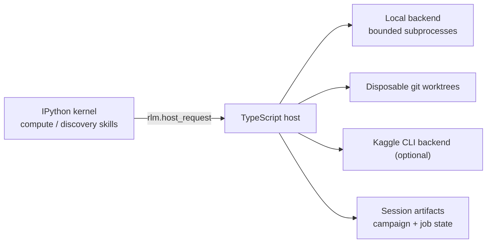

# Compute-Driven Discovery

Prime Agent doesn't become smarter merely because GPUs are available.

Compute-driven discovery works by turning execution into experience:

```text
propose -> execute -> observe -> preserve -> reinterpret -> propose again
```

The LLM proposes candidate interventions. Real computational jobs execute
them. Their outputs become observations the model did not know beforehand.
Subsequent reasoning is conditioned on those observations, not merely on more
reasoning tokens.

## Philosophy

```text
LLM reasoning generates possibilities.
Computation creates experience.
Objective execution constrains belief.
Surprise creates new questions.
Persistent memory makes discovery cumulative.
```

The system supports optimization and broader discovery. It is explicitly not
hill climbing: candidates that score poorly are not discarded. The host keeps
four additive archives so novel, surprising, and informatively failing
results remain searchable — a poor performer may lead to a better
representation later.

## Architecture

Two host-side subsystems, both owned by the TypeScript host:

```text
packages/coding-agent/src/core/compute/        provider-neutral job execution
packages/coding-agent/src/core/discovery/      campaigns, experiences, archives
```



### Compute runtime

The `ComputeRuntime` is the authoritative job manager. It validates requests,
enforces budgets (job count, concurrency, wall time, output size), tracks
resource usage, and persists job records under the session artifact directory.
Backends only execute.

- `submit`, `status`, `result`, `poll`, `cancel`, `list`, `budget`
- durable job ids (`job_...`)
- bounded stdout/stderr capture with truncation flags
- result protocol parsing (see below)
- optional per-job `files` materialized into the job working directory

### Backends

**Local** (`local`, always available): executes commands as detached child
processes with enforced timeouts and output caps. Cancellation kills the
process tree. Local execution inherits host permissions — this is not a
security sandbox.

**Kaggle** (`kaggle`, optional): orchestrates Kaggle kernel scripts through
the official Kaggle CLI when installed and authenticated. `available()`
probes the CLI; unauthenticated setups degrade to a clean error. No
credentials are hard-coded or logged. Result artifact download is deferred.

**Future backends** (GCP, Colab Enterprise, Modal, RunPod, Lambda, Prime
Intellect infrastructure, Slurm, Kubernetes) implement the same
`ComputeBackend` interface. Free Colab is intentionally not automated.

### Worktree isolation

Repository-changing experiments can request `isolation: "worktree"`. The
runtime creates a disposable `git worktree add` checkout of the current
repository HEAD, runs the job inside it, and cleans it up on dispose. This
prevents parallel candidates from corrupting the same checkout. Isolation is
still not a security boundary.

### Discovery engine

The `DiscoveryEngine` implements the search loop as explicit persisted state:

- **Campaign** (`dc_...`): objective, status, budgets, usage, baseline,
  summary, and the four archive id lists.
- **Experience** (`exp_...`): one candidate. Hypothesis, rationale,
  intervention, predicted metrics, parents, operators, generation, selection
  reason, compute result, scores, archives, replication evidence.
- **Lineage**: `parent_experience_ids`, `operators` (mutate, combine,
  invert, simplify, generalize, specialize, remove_assumption,
  change_representation, change_objective, adversarial_variant,
  extreme_case, random_restart, counterexample_search, baseline), and
  `reason_selected` let later agents trace where a discovery came from.
- **Scoring**: objective score (per-metric direction vs baseline),
  novelty (parameter/metric-vector distance), numeric surprise (predicted
  vs observed), validity, and a weighted composite. Scores never delete a
  candidate.
- **Archives**: elite, novelty, surprise, and interesting-failure; additive
  membership.
- **Baselines**: `set_baseline` records reference metrics; summaries express
  relative changes. A passing exit code is not evidence of improvement.
- **Replication**: re-run a completed experience across seeds with aggregate
  mean/min/max/stddev and success counts.
- **Budgets**: `maxExperiences`, `maxTokens`, `maxWallTimeMs`,
  `maxComputeJobs`, `maxEstimatedGpuHours`, `maxEstimatedCostUsd`. Budget
  exhaustion stops or pauses the campaign cleanly and is machine-readable.

## Python APIs

Two bundled Python skills (see their `SKILL.md` for details):

```python
# Compute
job = await compute.submit("python bench.py --variant A", timeout_ms=120000)
result = await compute.result(job["job"]["jobId"])
await compute.budget()

# Discovery
campaign = await discovery.create("Find a faster implementation", budgets={"max_compute_jobs": 200})
await discovery.set_baseline(campaign["campaign"]["id"], metrics={"latency_ms": 142})
candidate = await discovery.add_candidate(
    campaign["campaign"]["id"],
    hypothesis="layout causes memory movement",
    intervention={"command": "python bench.py --variant B", "params": {"layout": "B"}},
    predicted_metrics={"latency_ms": 120},
    operators=["mutate"],
)
await discovery.replicate(campaign["campaign"]["id"], candidate["experience"]["id"], seeds=[1, 2, 3])
summary = await discovery.summarize(campaign["campaign"]["id"])
await discovery.complete(campaign["campaign"]["id"])
```

All state is validated host-side; the Python functions are thin typed
wrappers over `rlm.host_request`.

## Result protocol

Experiments should emit machine-readable results on stdout:

```json
{"prime_discovery_result": {"metrics": {"accuracy": 0.948, "latency_ms": 109.4}, "valid": true, "notes": "..."}}
```

or write the object to a file and pass `result_file` to the job. Plain
command output remains available alongside parsed metrics.

## RLM collaboration

Discovery campaigns compose with RLM children. Example parent strategy:

```python
proposer = await rlm("Generate structurally different candidate approaches for the active discovery campaign.", name="discovery-proposer")
critic = await rlm("Inspect experimental results and search for confounders or misleading wins.", name="discovery-critic")
```

The architecture does not require specific roles; any RLM child can read
campaign state through `discovery.*` and drive the loop.

## /goal and autonomous mode

A campaign works naturally under `/goal` — the goal is the durable objective;
the campaign is the structured search pursuing it. In autonomous mode, an
active campaign with budget remaining produces a bounded continuation
message; exhausted campaigns stop cleanly and never spin. Existing
autonomous limits (continuations, turns, tokens, timeouts, quality gates)
remain authoritative.

## /refine integration

Experimental observations are not automatically permanent truths. A
validated campaign can produce refinement provenance:

```json
{
  "source": "discovery",
  "campaign_id": "dc_...",
  "experience_ids": ["exp_..."],
  "replications": 8,
  "validation": "passed"
}
```

and the model should then persist the reusable lesson through `/refine`
(memory, skill, subagent spec, or prompt note). One lucky run must not
become global harness state.

## CLI

```text
/discovery status
/discovery start <objective>
/discovery pause <campaign-id>
/discovery resume <campaign-id>
/discovery stop <campaign-id>
```

## Security limitations

- Local execution inherits the host process permissions; it is not a
  security sandbox.
- Worktree isolation separates checkouts, not privileges.
- Kaggle jobs run under the authenticated Kaggle account.
- Output sizes, timeouts, concurrency, and job counts are always bounded.
- Secrets are never logged; Kaggle credentials are never read or echoed.

## Example: algorithm discovery (local, no GPU)

See `packages/coding-agent/examples/compute-discovery-demo.ts` for a
runnable end-to-end demo: baseline a deliberately inefficient implementation,
evaluate variants, preserve the best and a surprising failure, replicate the
winner, and print the campaign summary.
